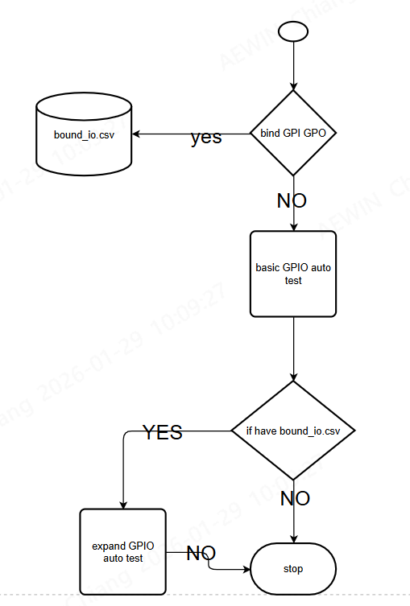

author	: lovequeen
date	:
Mon Jan 12 10:03:37 CST 2026
Thu Jan 29 09:42:27 CST 2026

-------------------------------------------------------------------------------

# EXECUTE

only execute just can auto test gpio

`./gpio_mix_auto.sh`


-------------------------------------------------------------------------------
---
# structure


---

## detail for DEV
From here begins the developer’s manual.

### Step 1 : gpio\_data.sh
creted
1. `gpio_database.csv`
參數檔案
```bash ====
-74h,GPO74,74,1
-74l,GPO74,74,0
-75h,GPO75,75,1
-75l,GPO75,75,0
```
2. `gpio_database_oppo.csv`
這比個參數檔就是 `gpio_database.csv` 相反


### Step 2 : gpio\_validate.sh
only created `match_p.csv`
就是給後續的定位參數檔案
也可以跟 `gpio_datatbase*` 來比較就知道
是硬體相反還是正相關


### Step 3 : gpio_execute.sh
created
1. `gpio_auto.log`
所有指令的所有LOG

2. `gpio_pass_file.log`
結論 通常看這個檔案 就可以知道 pass or failed

-------------------------------------------------------------------------------
---

# Bind GPI and GPO

```bash ================================================================
└── gpio_love_auto
    ├── bound_io.csv			---->expand bound use input
    ├── gpio_auto.log
    ├── gpio_auto_exp.log       ----> when expand -> log
    ├── gpio_database.csv
    ├── gpio_database_oppo.csv
    ├── gpio_pass_file.log
    ├── gpio_pass_file_ex.log   ----> expand log
    └── match_p.csv
```
這裡要說明 一定會跑 基本的測試 是全部指令跑一次然後自動驗證

但是如果綁定的寫法 筆者是用而外的寫法

就是如果使用者一開使不要的話 就不會有上面3個檔案的產生

`bound_io.csv` 是使用者自己輸入的 因為 GPI GPO 每個案子不同
